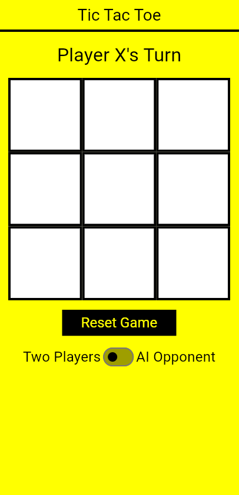
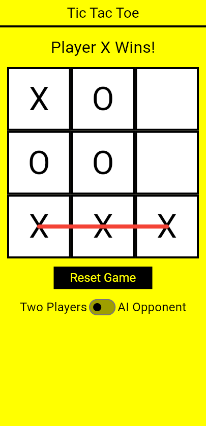

# Tic Tac Toe

This is a modern and stylish Tic Tac Toe app developed with Flutter. It offers two game modes, subtle animations, and a unique Neo-brutalism design.

## Features

- **Game Modes**
  - **AI Mode**: Challenge the AI (varying difficulties to be implemented later).
  - **Two Player Mode**: Play with a friend on the same device.
  
- **Neo-Brutalism Design**
  - Minimalist yet bold design with bright colors, sharp contrasts, and clean lines.

- **Subtle Animations**
  - Winning line animations, smooth transitions, and cell interactions.

## Screenshots



## Installation

1. Clone the repository:
   ```
   git clone https://github.com/Cod-e-Codes/tictactoe.git
   ```
2. Navigate to the project directory:
   ```
   cd tictactoe
   ```
3. Install dependencies:
   ```
   flutter pub get
   ```
4. Run the app:
   ```
   flutter run
   ```

## Developed By

This app was developed by [CodēCodes](https://www.cod-e-codes.com), also available on [GitHub](https://github.com/Cod-e-Codes).
